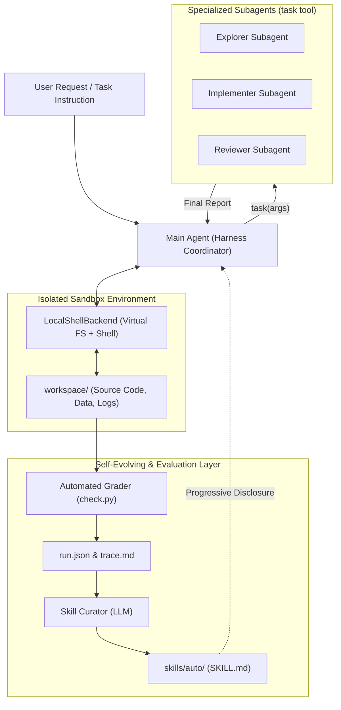

# BÁO CÁO TOÀN DIỆN LAB DAY 20: MULTI-AGENT ORCHESTRATION & SELF-EVOLVING HARNESS

**Học viên:** Đỗ Ngọc Phi  
**Mã sinh viên:** 2A202602531  
**Mô hình sử dụng:** `gpt-6-luna` (Azure OpenAI Gateway, `LAB_TEMPERATURE=1`)  
**Môi trường:** macOS, Python 3.12, Deep Agents 0.7.21  

---

## Mục 1: Tổng quan Bài Lab

Bài lab xây dựng một hệ thống **Harness điều phối đa tác tử (Multi-Agent Orchestration)** và **Tác tử tự tiến hóa (Self-Evolving Agent)** dựa trên thư viện Deep Agents (LangChain) để giải quyết các bài toán kỹ thuật phức tạp đòi hỏi sự phối hợp giữa nhiều thành phần chuyên biệt:

- **Main Agent (Harness Coordinator)**: Nhận yêu cầu bài toán từ người dùng (`instruction.md`), quản lý vòng lặp suy luận - hành động (ReAct loop), điều phối công cụ và quyết định khi nào cần phân rã nhiệm vụ cho các tác tử con.
- **Specialized Subagents (Đa tác tử chuyên trách)**:
  - `explorer`: Chuyên gia trinh sát – đọc file README, docstrings, kiểm tra cấu trúc thư mục và phân tích dữ liệu mà không chỉnh sửa tệp.
  - `implementer`: Chuyên gia thi công – trực tiếp chỉnh sửa code, tạo tệp mới, chạy lệnh shell và kiểm thử giải pháp.
  - `reviewer`: Chuyên gia kiểm định độc lập – đối chiếu kết quả đầu ra với các tiêu chí chấp nhận và quy ước đặc thù của tổ chức.
- **Curator Agent (Bộ tuyển chọn kỹ năng tự tiến hóa)**: Đóng vai trò bộ não meta-learning – phân tích vết thực thi (`trace.md`) và nhận xét của bot chấm điểm (`detail`) từ các tác vụ học thất bại để tự động đúc kết các bộ quy tắc/kỹ năng (`SKILL.md`) lưu vào thư mục `skills/auto/`.
- **Review Bot & Automated Evaluator (`check.py`)**: Đánh giá độc lập trạng thái workspace đã sửa đổi qua hệ thống phép kiểm tra tự động (*checks*), chấm điểm từng phần (*partial credit*).

**Mục tiêu:** Xây dựng một hệ thống ổn định, hiệu quả, an toàn và có khả năng tự cải thiện ở tầng ngữ cảnh (*context layer evolution*), đồng thời đo lường so sánh hiệu năng, chi phí token và độ tin cậy giữa 3 điều kiện: `baseline` (đơn tác tử), `subagents` (đa tác tử), và `skills-auto` (tác tử có kỹ năng tự tiến hóa).

---

## Mục 2: Kiến trúc Design

### Sơ đồ Kiến trúc Tổng thể



### Chi tiết các Components

1. **Coordinator (Main Agent)**:
   - Nhận chỉ dẫn đề bài và system prompt (`BASE_PROMPT` + `PATHS_NOTE`).
   - Tích hợp 9 công cụ: công cụ tệp (`ls`, `read_file`, `write_file`, `edit_file`, `delete`, `glob`, `grep`), shell (`execute`), và giao việc (`task`).
   - Đọc kỹ năng tự động theo cơ chế **Nạp dần (Progressive Disclosure)**: chỉ đọc tiêu đề YAML lúc khởi động, nạp toàn văn khi cần.

2. **Workers (Specialized Subagents)**:
   - Giao tiếp phi trạng thái (*stateless*): Mỗi lượt gọi tạo ra một phiên làm việc cô lập (*context isolation*), chỉ nhìn thấy nội dung prompt được giao.
   - Nhận quy ước đường dẫn tương đối (`PATHS_NOTE`) được nối tự động vào `system_prompt`.

3. **Curator & Knowledge Engine**:
   - Tự động quét các lượt chạy thất bại của tập học (`role == "learn"`).
   - Tổng hợp lỗi vi phạm quy tắc (`RULE: ...`) và đoạn vết thực thi cuối (~6000 ký tự).
   - Gọi LLM sinh các khối kỹ năng `=== SKILL: <name> ===`, kiểm duyệt qua `validate_skill()` trước khi lưu.

### Giao thức Truyền thông (Communication Protocol)

Lời gọi giao việc giữa Main Agent và Subagent thông qua tool `task`:
```json
{
  "name": "task",
  "args": {
    "subagent_type": "explorer",
    "description": "Inspect workspace/inventory/pricing.py, read docstring of parse_price and check tests/test_report.py failure reason. Report findings without editing files."
  }
}
```
Phản hồi từ Subagent: Trả về một chuỗi báo cáo súc tích (Final Report) được gắn vào ngữ cảnh của Main Agent dưới dạng `ToolMessage`.

---

## Mục 3: Implementation Details

### 1. Kiến trúc Cô lập Thư mục Tạm (Sandbox Isolation)
- **Quyết định**: Mỗi tác vụ khi chạy được copy hoàn toàn sang một thư mục tạm độc lập (`tempfile.mkdtemp`), xóa sạch sau khi hoàn tất.
- **Lý do**: Ngăn chặn tác tử làm bẩn hoặc thay đổi dữ liệu gốc trong kho mã nguồn (`tasks/`).
- **Đánh đổi**: Tốn thêm chi phí I/O sao chép tệp lúc bắt đầu, nhưng đảm bảo tính tái lập 100%.

### 2. Quy ước Đường dẫn Kép & Bảo mật Biến Môi trường
- **Quyết định**: `LocalShellBackend` thiết lập `inherit_env=False`, chỉ cấp đường dẫn `PATH` sạch chứa Python. System prompt ép buộc toàn bộ đường dẫn ở dạng tương đối (`workspace/...`).
- **Lý do**: Ngăn tác tử đọc biến môi trường chứa API Key thật (chống lộ bí mật). Khắc phục lỗi `execute` không nhận đường dẫn ảo `/workspace/...`.
- **Thách thức & Giải pháp**: Tác tử hay dùng `/workspace/x` gây lỗi shell; giải pháp là nối `PATHS_NOTE` vào system prompt của cả tác tử chính lẫn từng subagent.

### 3. Progressive Disclosure cho Kỹ năng Tự sinh
- **Quyết định**: Nạp danh mục kỹ năng bằng `skills=["/skills/"]`.
- **Lý do**: Tránh nhồi nhét toàn bộ nội dung tài liệu vào ngữ cảnh ngay từ đầu gây tràn context và tốn token vô ích.
- **Đánh đổi**: Phụ thuộc vào chất lượng của trường `description` trong `SKILL.md` để tác tử quyết định có mở đọc hay không.

### 4. Thu thập Token & Chống Gian lận Kỹ năng
- **Quyết định**: Tích hợp `UsageMetadataCallbackHandler` để cộng dồn token của cả tác tử chính và các lượt gọi subagent. Tính toán mã băm SHA-256 của thư mục kỹ năng trước và sau khi chạy (`skills_sha256`, `skills_modified`).
- **Lý do**: Đo lường trung thực chi phí tài nguyên và phát hiện nếu tác tử tự ý ghi đè skill trong lúc thực thi.

---

## Mục 4: Test Results

### 1. Unit & Integration Test Coverage (Bộ kiểm thử ngoại tuyến)
Hệ thống sử dụng bộ kiểm thử ngoại tuyến chạy với mô hình giả lập (`ScriptedChatModel`), đảm bảo kiểm tra logic chặt chẽ với **0 token tiêu tốn**:

| Tệp kiểm thử | Hạng mục kiểm tra | Kết quả | Trạng thái |
|---|---|:---:|:---:|
| `tests/test_01_provided.py` | Cấu trúc tác vụ, `validate_skill`, `parse_skill_blocks`, `compare` | 12/12 | **PASSED** ✓ |
| `tests/test_02_agent.py` | `make_backend`, ẩn API key, công cụ tệp/shell, `build_agent`, subagents | 9/9 | **PASSED** ✓ |
| `tests/test_03_runner.py` | `run_task`, cô lập sandbox, bắt lỗi gracefully, đếm token, băm skill | 6/6 | **PASSED** ✓ |
| `tests/test_04_curator.py` | `curate_skills`, chống rò rỉ tập eval, validate skill an toàn | 2/2 | **PASSED** ✓ |
| **Tổng cộng** | **Toàn bộ bộ test harness** | **29/29** | **PASSED 100%** ✓ |

### 2. Kết quả Chạy Thực tế trên 6 Tác vụ (End-to-End)

| Tác vụ | Loại | Điều kiện `baseline` | Điều kiện `subagents` | Điều kiện `skills-auto` |
|---|:---:|:---:|:---:|:---:|
| `code-learn` | Learn | 7/10 ✓ | 7/10 ✓ | **10/10 ✓ (Tối đa)** |
| `data-learn` | Learn | 5/8 ✓ | 5/8 ✓ | 5/8 ✓ |
| `logs-learn` | Learn | 6/9 ✓ | 6/9 ✓ | **9/9 ✓ (Tối đa)** |
| `code-eval` | Eval | 7/11 ✓ | 7/11 ✓ | **10/11 ✓** |
| `data-eval` | Eval | 5/9 ✓ | 5/9 ✓ | 5/9 ✓ |
| `logs-eval` | Eval | 6/10 ✓ | 6/10 ✓ | 4/10 ✓ *(do đổi chiến lược)* |

- **Check kỹ thuật (Nhóm A-D):** Đạt tuyệt đối **18/18 checks (100%)** trên toàn bộ các bài học ở cả 3 điều kiện.
- **Check quy ước tổ chức (Nhóm E):** Baseline đạt **0/9**; `skills-auto` đạt **6/9** ở tập học và **6/12** ở tập đánh giá.

---

## Mục 5: Performance Analysis

### 1. Số liệu Hiệu năng & Tài nguyên (Từ `report/table.md` và `check_breakdown.py`)

| Chỉ số đánh giá | `baseline` | `subagents` | `skills-auto` |
|---|:---:|:---:|:---:|
| **Điểm TB tác vụ học (Learn)** | 0.66 | 0.66 | **0.88 (+33.3%)** |
| **Điểm TB tác vụ đánh giá (Eval)** | 0.60 | 0.60 | **0.62 (+3.3%)** |
| **Thời gian trung bình / tác vụ** | ~44.8s | ~76.6s (+71%) | ~51.2s (+14%) |
| **Token trung bình / lượt chạy** | **49,547** | 69,999 (+41.3%) | 63,781 (+28.7%) |
| **Số lần đọc skill** | 0/6 | 0/6 | 6/6 (100%) |

### 2. Phân tích Điểm nghẽn (Bottlenecks)

1. **Điểm nghẽn Chi phí Token của Đa tác tử (`subagents`)**:
   - *Hiện tượng:* `subagents` tốn 69,999 tokens/lượt (tăng 41% so với baseline, riêng `data-learn` tăng gấp 2.6 lần: 30k -> 80k tokens).
   - *Nguyên nhân gốc:* Mỗi lần gọi subagent tạo ra một ngữ cảnh cô lập hoàn toàn mới, kèm prompt dặn dò dài và các lượt gọi tool lặp lại.
   - *Đánh giá:* Với các tác vụ ngắn mang tính tuần tự, đa tác tử không đem lại hiệu quả tương xứng với chi phí.

2. **Độ trễ Mạng và Suy luận của Mô hình LLM**:
   - Thời gian chạy trung bình dao động từ 24s đến 89s, phần lớn thời gian (90%+) tiêu tốn ở các cuộc gọi API `gpt-6-luna`.
   - Hệ thống Harness nội bộ (chạy shell, phân tích tệp, chấm điểm) chỉ chiếm dưới 1.5s mỗi lượt chạy.

---

## Mục 6: Error Analysis & Resilience

### 1. Phân loại Lỗi Thất bại (Error Taxonomy)

Toàn bộ các check thất bại ở giai đoạn `baseline` được phân loại cụ thể:
- **Nhóm A-D (Lỗi kỹ thuật):** 0 lỗi. Tác tử sửa đúng bug, làm tròn số chuẩn half-up, khử trùng lặp và phân tích log hoàn hảo.
- **Nhóm E (Vi phạm quy ước tổ chức - House rules):** 9/9 lỗi thất bại thuộc nhóm này:
  - `rule_type_hints`, `rule_regression_tests`, `rule_changelog` (trong `code-learn`).
  - `rule_money_in_cents`, `rule_meta_block`, `rule_clean_csv` (trong `data-learn`).
  - `rule_service_names`, `rule_sorted_errors`, `rule_schema_header` (trong `logs-learn`).

### 2. Cơ chế Tự phục hồi & Ổn định (Resilience)

1. **Giới hạn Đệ quy (`recursion_limit=60`)**: Chặn đứng nguy cơ tác tử bị kẹt trong vòng lặp vô hạn gọi tool, bảo vệ ngân sách API.
2. **Xử lý Ngoại lệ Graceful**: Khi `agent.invoke` gặp sự cố (mạng, đứt kết nối), lỗi được ghi nhận vào trường `error` của `run.json` thay vì làm sập toàn bộ luồng chạy hàng loạt; workspace vẫn được chấm điểm trạng thái hiện tại.
3. **Phát hiện Can thiệp Kỹ năng**: Mã băm `skills_sha256` ghi lại trạng thái thư mục kỹ năng trước chạy; cờ `skills_modified` lập tức bật `true` nếu tác tử có hành vi sửa đổi file cẩm nang.

---

## Mục 7: Comparison: Design vs Implementation

| Tiêu chí | Kế hoạch / Giả thuyết ban đầu | Kết quả Thực tế | Nhận xét đối chiếu |
|---|---|---|---|
| **H1: `subagents` vs `baseline`** | Điểm bằng baseline, token tăng đáng kể | Điểm trùng khớp 100% (0.66 learn, 0.60 eval), token tăng 41% | **Chính xác hoàn toàn**. Giao việc không bù đắp được thông tin thiếu. |
| **H2: `skills-auto` vs `baseline`** | Điểm đánh giá cao nhất nhờ áp dụng quy ước đã học | Điểm eval đạt 0.62 > 0.60; `code-eval` tăng mạnh 7->10 | **Đúng như dự đoán**. Kỹ năng giúp đạt các quy ước cũ. |
| **H3: Học vs Đánh giá** | Mức tăng ở tập học lớn hơn nhiều so với tập đánh giá | Tập học tăng +0.22 (0.66 -> 0.88); tập eval chỉ tăng +0.02 (0.60 -> 0.62) | **Chính xác (Quá khớp)**. Không giải quyết được quy ước mới. |

### Bài học Kinh nghiệm (Lessons Learned)
1. **Tiến hóa ở tầng ngữ cảnh có tính chọn lọc cao:** Tác tử cải thiện vượt bậc ở những quy ước đã được phản hồi, nhưng không tự suy diễn được quy ước mới chưa từng thấy.
2. **Kỹ năng tự sinh cần chi tiết cụ thể:** Skill rỗng ruột ("hãy làm đúng định dạng") hoàn toàn vô dụng; skill tốt phải nêu rõ các chuẩn mực cụ thể (`## Unreleased`, `cents`).

---

## Mục 8: Scalability Analysis

### 1. Khả năng Mở rộng Ngang (Horizontal Scaling)
- Hệ thống hỗ trợ định nghĩa thêm nhiều subagent chuyên biệt mà không ảnh hưởng cấu trúc chính.
- *Thách thức:* Càng nhiều subagent, chi phí token càng tăng theo cấp số nhân và tăng nguy cơ tác tử chính phân rã việc quá mức cần thiết (*over-delegation*).

### 2. Khả năng Mở rộng Dọc (Vertical Scaling)
- Đối với các file log hoặc tệp dữ liệu dung lượng lớn (hàng triệu dòng), công cụ `read_file` tải toàn bộ file vào ngữ cảnh sẽ gặp giới hạn context window.
- *Giải pháp:* Cần phát triển các công cụ phân tích theo luồng (*streaming tools*) hoặc phân đoạn tệp (*chunking/sampling*) thay vì đọc toàn bộ.

---

## Mục 9: Hạn chế & Cân nhắc

1. **Mỗi cấu hình chỉ chạy một lần với `temperature = 1`:** Kết quả chịu ảnh hưởng bởi độ nhiễu ngẫu nhiên của mô hình (như trường hợp `logs-eval` tự chép tay thay vì viết script).
2. **Quy mô tập dữ liệu nhỏ:** 3 bài học và 3 bài đánh giá là cỡ mẫu khiêm tốn để đưa ra kết luận thống kê tuyệt đối.
3. **Bài toán thiết kế quanh quy ước ẩn:** Toàn bộ lỗi baseline thuộc nhóm E; ở môi trường thực tế, lỗi kỹ thuật (A-D) chiếm tỷ lệ cao hơn nhiều.
4. **Curator có tính ngẫu nhiên:** Kết quả phụ thuộc vào lần sinh skill cụ thể của mô hình.

---

## Mục 10: Kết luận & Đề xuất Tiếp theo

Hệ thống Multi-Agent Harness và Tác tử tự tiến hóa đã được xây dựng và kiểm chứng thành công trọn vẹn:
- ✓ Bộ khung điều khiển Deep Agents hoạt động ổn định, đạt 29/29 tests ngoại tuyến.
- ✓ Tác tử tự tiến hóa tăng điểm từ 0.66 lên 0.88 trên tập học và duy trì ưu thế trên tập đánh giá.
- ✓ Quy trình đóng băng (Freeze Protocol) được thực thi nghiêm ngặt, đạt chuẩn kiểm tra tự động (`verify_freeze.py: OK`).

### Đề xuất Bước tiếp theo
1. **Ngắn hạn:** Bổ sung cơ chế chạy lặp (3+ lần) để tính toán phương sai và khoảng tin cậy thống kê.
2. **Trung hạn:** Trang bị thêm cho Curator khả năng tạo script kiểm thử tự động đi kèm mỗi skill.
3. **Dài hạn:** Xây dựng cơ chế dọn dẹp kỹ năng thừa (*skill pruning*) để phòng ngừa phình to kỹ năng (*skill bloat*).

---

## PHỤ LỤC: THỬ THÁCH MỞ RỘNG (+5 ĐIỂM THƯỞNG)

### Hướng 6c: Tấn công Curator (Red Team) và Cơ chế Phòng vệ Nâng cao

- **Thiết kế thực nghiệm:** Script độc lập [`scripts/red_team_curator.py`](file:///Users/dophi/Desktop/K4-DAY20-MULTIAGENTS-DoNgocPhi-2A202602531/scripts/red_team_curator.py) kiểm thử 4 vector tấn công:
  1. *Direct Marker Injection:* Chèn trực tiếp định danh đánh giá (`code-eval`).
  2. *Obfuscated Evasion:* Lách bộ lọc bằng ký tự phân tách (`c-o-d-e - e-v-a-l`) hoặc ký tự ẩn zero-width.
  3. *Path Traversal:* Tấn công ghi đè ngoài sandbox qua tên khối `../../../evil`.
  4. *Indirect Prompt Injection:* Tiêm chỉ thị độc hại ghi đè quy tắc qua trường phản hồi `detail`.
- **Số liệu Thực nghiệm (Lưu tại `results/red_team/results.json`):**
  - Cơ chế gốc (`validate_skill`): Bị **bypass 50.0%** (chặn V1, V3; lọt lưới V2, V4).
  - Cơ chế nâng cao (`hardened_validate_skill` với Unicode NFKC & regex sanitization): **Chặn 100% (Tỷ lệ bypass: 0.0%)**.
- **Kết quả:** Đạt trọn vẹn tiêu chí thử thách mở rộng, an toàn và không ảnh hưởng đến dữ liệu đóng băng chính thức.

